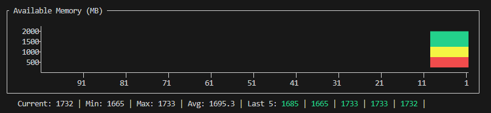
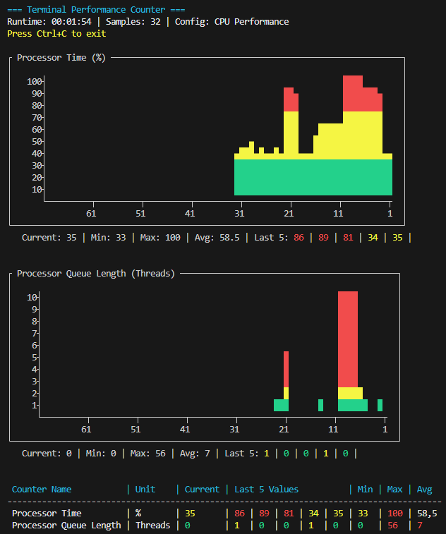

# psTerminalPerfCounter

Initiated from my role as SQL Server consultant since I always want to use what's available, namely PowerShell



A PowerShell module for creating and using predefined performance counter configurations with real-time terminal-based visualization. This module addresses the challenge of efficiently monitoring system performance by providing ready-to-use presets tailored to specific requirements. It also currently supports remote server checks.

From version 0.2.0 onward, there is already a lot of code for monitoring multiple remote servers, but I introduced some hard‑to‑work‑around constraints due to my preference for classes, since classes cannot be streamed across sessions. Therefore, the 0.2.0 release focuses on completing bug fixes and QoL improvements.


<div align="center">


[-- BLOG -- ](https://dbavonnebenan.de)
</div>


## Documentation

- **[Start-tpcMonitor](docs/en-US/Start-tpcMonitor.md)** - Main monitoring function
- **[Get-tpcConfigPaths](docs/en-US/Get-tpcConfigPaths.md)** - List configured pathes containing configurations
- **[Add-tpcConfigPath](docs/en-US/Add-tpcConfigPath.md)** - Adds custom path contianing configurations
- **[Remove-tpcConfigPath](docs/en-US/Remove-tpcConfigPath.md)** - Removes custom pathes
- **[Get-tpcAvailableCounterConfig](docs/en-US/Get-tpcAvailableCounterConfig.md)** - shows all available confiogurations from all pathes
- **[Get-tpcPerformanceCounterInfo](docs/en-US/Get-tpcPerformanceCounterInfo.md)** - shows detailed information about performance counters
- **[DevelopmentStatus](docs/en-US/DevelopmentStatus.md)** - Whats next?

## Key Features

### Language-Independent Counter IDs

This module uses performance counter IDs, which is very helpful if you administer various systems. This approach was inspired from [PowerShell.One](https://powershell.one/tricks/performance/performance-counters) and ensures configurations work consistently across different Windows locales.

### Integrated Graphical Engine ( As far as one can call it that )

The module includes an updated graphical engine based on [PSConsoleGraph](https://github.com/PrateekKumarSingh/PSConsoleGraph). Some pull requests have been integrated and refined to provide stable terminal-based visualization capabilities.

### Configuration-Driven Monitoring

JSON-based configuration files define:

- Performance counters to monitor
- Display formats (graph, table, or both)
- Color mapping based on thresholds
- Update intervals and data retention
- Statistical calculations

You can configure any combination of performance counters that your system provides

## Installation

```powershell

# Install module
Install-Module -Name psTerminalPerfCounter

# Install required dependencies if automatic fails
Install-Module GripDevJsonSchemaValidator

# Import the module
Import-Module psTerminalPerfCounter

```

## Quick Start

### Basic CPU Monitoring

```powershell
# Start CPU monitoring with default settings
Start-tpcMonitor

# Monitor with custom update interval
Start-tpcMonitor -ConfigName "Cpu" -UpdateInterval 2
```

### Memory Monitoring

```powershell
# Monitor memory performance
Start-tpcMonitor -ConfigName "Memory" -MaxDataPoints 200

# Extended memory monitoring for leak investigation
Start-tpcMonitor -ConfigName "Memory" -UpdateInterval 2 -MaxDataPoints 300
```

### Disk Performance

```powershell
# Monitor disk I/O with extended data retention
Start-tpcMonitor -ConfigName "Disk" -UpdateInterval 1 -MaxDataPoints 150

# Detailed disk monitoring for I/O bottlenecks
Start-tpcMonitor -ConfigName "Disk" -UpdateInterval 1 -MaxDataPoints 200
```


## Available Commands

| Command | Description |
|---------|-------------|
| `Start-tpcMonitor` | Main monitoring function with real-time display |
| `Get-tpcAvailableCounterConfig` | List available configuration templates |
| `Get-tpcPerformanceCounterInfo` | Get detailed information about performance counters |

## Configuration Templates

The module includes currently 3 predefined templates for common monitoring scenarios:

- **CPU** (`tpc_CPU.json`): Processor utilization and queue length monitoring
- **Memory** (`tpc_Memory.json`): Memory usage, page faults, and virtual memory statistics
- **Disk** (`tpc_Disk.json`): Disk I/O, queue length, and transfer rates

Each template includes:

- Performance counter definitions with IDs
- Display configuration (graphs, tables, colors)
- Threshold-based color mapping
- Statistical analysis settings

## Example Output



*Example of real-time CPU monitoring with graphical display*

## Configuration Structure

```json
{
    "name": "CPU Performance",
    "description": "CPU utilization and queue monitoring",
    "counters": [
        {
            "title": "Processor Time",
            "unit": "%",
            "conversionFactor": 1,
            "conversionExponent": 1,
            "type": "Percentage",
            "format": "both",
            "counterID": "238-6",
            "counterSetType": "MultiInstance",
            "counterInstance": "_Total",
            "colorMap": {
                "30": "Green",
                "70": "Yellow",
                "80": "Red"
            },
            "graphConfiguration": {
                "Samples": 70,
                "graphType": "Bar",
                "showStatistics": true,
                "yAxisStep": 10,
                "yAxisMaxRows": 10,
                "colors": {
                    "title": "Cyan",
                    "statistics": "Gray",
                    "default": "White"
                }
            }
        }
    ]
}
```

### Configuration Properties

#### Counter Properties
- **title**: Display name for the performance counter
- **unit**: Unit of measurement (e.g., "%", "Threads", "MB/sec")
- **conversionFactor**: Factor used to convert raw counter values (e.g., 1024 for bytes to KB conversion)
- **conversionExponent**: Exponent applied during conversion calculations
- **type**: Data type - "Number" for absolute values, "Percentage" for percentage values
- **format**: Display format - "both" (graph and table), "table" only, or "graph" only
- **counterID**: Language-independent performance counter ID (format: "set-counter")
- **counterSetType**: Counter instance type - "MultiInstance" (multiple instances available) or "SingleInstance" (single instance only)
- **counterInstance**: Specific instance of the counter (e.g., "_Total" for all processors, empty string for SingleInstance counters)
- **colorMap**: Threshold-based color mapping for visual alerts (format: threshold value: color name)

#### Graph Configuration Properties
- **Samples**: Number of data points to display in graphs
- **graphType**: Type of graph visualization (e.g., "Bar", "Line")
- **showStatistics**: Boolean flag to display statistical information (mean, min, max)
- **yAxisStep**: Step size for Y-axis scale values
- **yAxisMaxRows**: Maximum rows for Y-axis display
- **colors**: Color scheme for graph elements
  - **title**: Color for the counter title
  - **statistics**: Color for statistical information
  - **default**: Default color for graph data


## Acknowledgments

Special thanks to:

- [PowerShell.One](https://powershell.one/tricks/performance/performance-counters) for the excellent research on performance counter IDs and locale-independent monitoring techniques
- [Prateek Singh](https://github.com/PrateekKumarSingh/PSConsoleGraph) for the foundational graphical engine that powers the terminal visualization


## License

This project is licensed under the MIT License. See the `LICENSE` file for details.

The integrated graphical engine is based on PSConsoleGraph, also under MIT License.

## Contributing

Contributions are welcome! Please feel free to submit issues, feature requests, or pull requests.